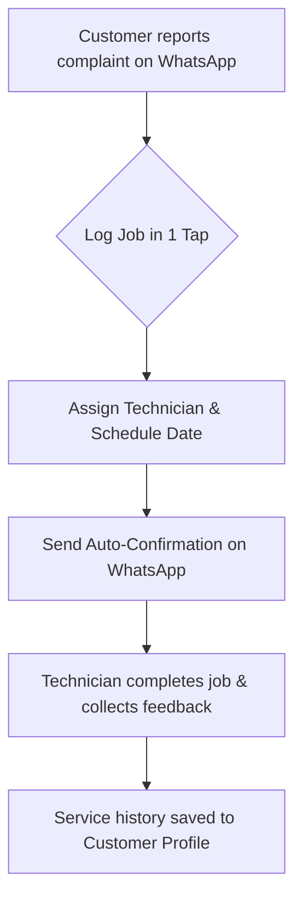

For a busy water purifier dealer, customer service is a balancing act. On any given day, you receive dozens of messages: 
*   *"My filter is leaking."*
*   *"The water tastes salty."*
*   *"When is the technician coming?"*

When these complaints land on a personal phone or a single WhatsApp account, details get lost. You forget to assign the technician, the customer gets angry, and your reputation suffers.

A successful dealership doesn't need complex, expensive software that technicians hate using. You just need to organize your service visits and complaints **inside the same WhatsApp chat where they arrived**.

Here is how you can set up a modern RO service management system using WhatsApp.

---

## The 4 Steps to WhatsApp-Based Service Management

### Step 1: Log the Complaint in One Tap
When a customer sends a message about a repair need, don't let it sit as an unread message. Convert it into a **Service Job** immediately. 
Your dashboard should allow you to associate the complaint with the customer's existing profile (installed model, warranty status, and address) in one click, without copy-pasting.

### Step 2: Assign the Technician & Schedule
Once the job is logged, select the assigned technician and set the scheduled date and time slot (e.g., *"Monday between 2 PM and 4 PM"*). 
Keeping this log digital means your office staff can view a unified calendar of all pending technician visits across the city, avoiding double bookings.

### Step 3: Send Instant WhatsApp Confirmations
Technicians frequently show up when the customer is not at home, leading to wasted travel time and fuel costs. 
Solve this by automating a confirmation message the moment the job is scheduled:
> *"Hi [Customer Name], your service visit has been scheduled for [Date] at [Time]. Our technician [Technician Name] ([Technician Phone]) will visit your address. Please ensure someone is available."*

Having this sent automatically in the same WhatsApp thread ensures the customer sees it and can reschedule immediately if needed.

### Step 4: Track Service History
Every filter change, membrane replacement, and electrical repair must travel with the customer's profile. When the customer messages you again six months later, you should be able to see the full service history:
*   *Jan 2025: Sedimate filter replaced.*
*   *July 2025: Booster pump repaired.*

This history gives your technicians context before they even arrive, making them look highly professional and enabling them to carry the right spare parts.

---

## Solving the Mobile Workforce Challenge

RO service technicians are always on the move. They do not have time to log into complicated desktop dashboards. 
By using a mobile-optimized CRM, your office team can schedule visits on a central desktop view, and technicians receive job assignments directly on their phones. They can view the address, tap to call the customer, and mark the job as "completed" in seconds.

---

## Why This Builds Long-Term Value

Moving your service management to WhatsApp doesn't just save time—it build **trust**. 
Customers appreciate instant scheduling, clear arrival confirmations, and having their repair history remembered. When your AMC is due for renewal next year, they will renew without hesitation because your service experience was flawless.

[LeadBuddie](file:///ro-service-management) is built specifically for water purifier dealers to handle leads, bookings, service tracking, and AMC renewals in one clean WhatsApp CRM. [Try it for free](https://app.leadbuddie.com) and organize your service visits today.
