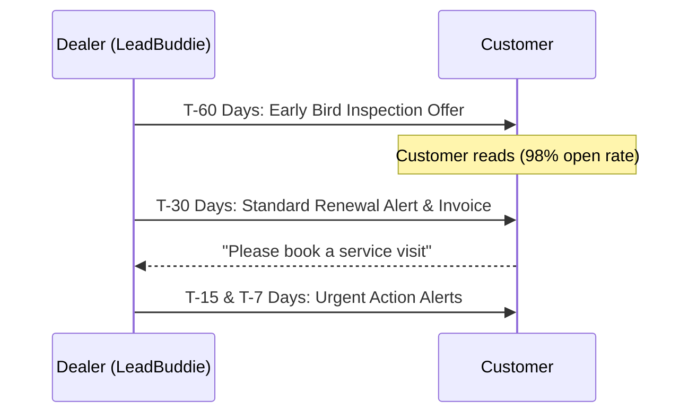

For local water purifier (RO) sales and service dealers in India, the Annual Maintenance Contract (AMC) is the lifeblood of the business. It provides predictable, recurring revenue and keeps your technicians busy year-round. 

Yet, industry data shows that **average dealers lose 30% to 40% of their AMC renewals every single year**. 

The leak doesn't happen because customers are unhappy. It happens because dealers are busy, records are scattered in paper notebooks, and follow-ups are missed. By the time someone remembers to call a customer whose AMC expired three months ago, they’ve already found another local technician on Google or Justdial.

In this playbook, we will show you how to plug this leak completely by automating your AMC renewal sequences on WhatsApp, which enjoys a 98% open rate compared to email or SMS.

---

## The Math: Why AMC Renewals Matter

Before looking at the workflow, let's look at the financial impact. If you have 1,000 active AMC customers paying an average of ₹2,500/year, your annual recurring revenue is **₹25 Lakhs**.

*   **At a 60% renewal rate (standard manual follow-up)**: You retain ₹15 Lakhs. You lose **₹10 Lakhs** in recurring revenue.
*   **At a 90% renewal rate (automated WhatsApp follow-up)**: You retain ₹22.5 Lakhs. You recover **₹7.5 Lakhs** in "free" revenue that was previously leaking.

Over three to five years, this difference compounding determines whether your dealership grows or gets stuck in a cycle of constant customer acquisition.

---

## The Automated WhatsApp Reminder Sequence

To get a 90%+ renewal rate, you cannot rely on a single message sent the day the contract expires. You need a multi-step sequence that guides the customer from awareness to booking. 

Here is the high-converting 4-part reminder sequence used by top water purifier dealers:

### 1. The T-60 Day Nudge: Early-Bird Inspection
*   **Goal**: Open the conversation early by offering value.
*   **Message**: 
    > *"Hi [Customer Name], your Aquaguard RO AMC is expiring in 60 days. To keep your water pure, we want to schedule a free pre-expiry checkup this week. Reply 'YES' to choose a day."*
*   **Why it works**: It doesn't ask for money yet. It offers service, building goodwill and confirming that the number is active.

### 2. The T-30 Day Alert: Renewal Details & Pricing
*   **Goal**: Present the formal renewal options.
*   **Message**: 
    > *"Hi [Customer Name], your water purifier AMC is due for renewal on [Expiry Date]. We have generated your package invoice for ₹2,499. You can pay via the secure payment link below to activate another year of clean water: [Payment Link]"*
*   **Why it works**: It makes the transition seamless. Providing a secure online payment link (like Razorpay or Cashfree) allows them to renew in 10 seconds without phone calls.

### 3. The T-15 Day Nudge: Urgent Follow-Up
*   **Goal**: Create a gentle sense of urgency.
*   **Message**: 
    > *"Hi [Customer Name], just a quick reminder that your RO AMC expires in 15 days. Renew today to avoid losing your free emergency breakdown visits and spare parts warranty. Tap here to renew: [Payment Link]"*

### 4. The T-7 Day Alert: Final Expiry Warning
*   **Goal**: The final automated nudge before expiry.
*   **Message**: 
    > *"Hi [Customer Name], your AMC expires in 7 days. After this date, standard service charges of ₹499 per visit will apply. Keep your family safe and save on maintenance by renewing now: [Link]"*

---

## Staying Compliant: How to Message Without Getting Blocked

Meta has strict rules regarding outbound messages. If you send unsolicited bulk messages, users will report you, and WhatsApp will ban your number. To prevent this:

1.  **Use Official Cloud API Templates**: Never send templates that have not been pre-approved by Meta.
2.  **Keep Content Utility-Focused**: Frame reminders as utility messages ("your contract is expiring") rather than spammy sales pitches ("BUY NOW 50% OFF!").
3.  **Include an Easy Opt-Out**: Always give them an option to stop receiving alerts (e.g., *"Reply STOP to unsubscribe"*).
4.  **Enforce Watch & Approval Modes**: Before moving to full automation, use an **Approval Desk** where you can review drafted reminders before they go out. This ensures that you never send a reminder to a customer who has already paid cash or called to cancel.

---

## How to Get Started with Zero Effort

If you keep customer records in physical paper notebooks, importing them is the biggest barrier to starting. 

With [LeadBuddie](file:///water-purifier-crm), you can take pictures of your customer notebook pages or send a messy Excel sheet, and our concierge team will format, clean, and upload your database for you. 

Once your database is uploaded, LeadBuddie's automated plays will automatically scan your expiry dates and prepare WhatsApp reminders on your own number.

[Start your free 1-month trial of the Growth Plan](https://app.leadbuddie.com) today and see how many lapsed AMCs you can win back this week.
