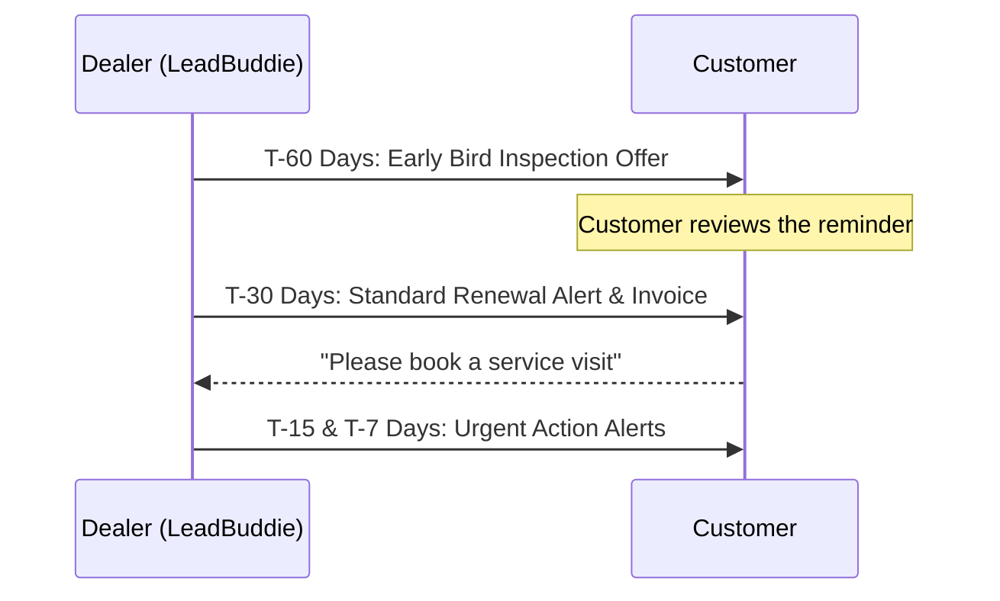

For local water purifier (RO) sales and service dealers in India, the Annual Maintenance Contract (AMC) is the lifeblood of the business. It provides predictable, recurring revenue and keeps your technicians busy year-round. 

When renewal dates live in notebooks, spreadsheets and individual chats, follow-ups are easy to miss.

The leak doesn't happen because customers are unhappy. It happens because dealers are busy, records are scattered in paper notebooks, and follow-ups are missed. By the time someone remembers to call a customer whose AMC expired three months ago, they’ve already found another local technician on Google or Justdial.

In this playbook, we will show you how to build a repeatable AMC reminder workflow on WhatsApp.

---

## The Math: Why AMC Renewals Matter

Before looking at the workflow, calculate your own baseline: active AMCs × average annual AMC value × your recorded renewal rate. The gap between potential and renewed value is the amount your team should investigate, rather than assuming a generic industry benchmark.

---

## The Automated WhatsApp Reminder Sequence

Do not rely on a single message sent on the expiry date. A multi-step sequence gives customers time to ask questions, compare options and book service.

Here is an example four-part reminder sequence. Adapt its timing, wording and offers to your actual AMC terms.

```mermaid
sequenceDiagram
    participant D as Dealer (LeadBuddie)
    participant C as Customer
    D->>C: T-60 Days: Early Bird Inspection Offer
    Note over C: Customer reviews the reminder
    D->>C: T-30 Days: Standard Renewal Alert & Invoice
    C-->>D: "Please book a service visit"
    D->>C: T-15 & T-7 Days: Urgent Action Alerts
```

### 1. The T-60 Day Nudge: Early-Bird Inspection
*   **Goal**: Open the conversation early by offering value.
*   **Message**: 
    > *"Hi [Customer Name], your Aquaguard RO AMC is expiring in 60 days. To keep your water pure, we want to schedule a free pre-expiry checkup this week. Reply 'YES' to choose a day."*
*   **Why it works**: It doesn't ask for money yet. It offers service, building goodwill and confirming that the number is active.

### 2. The T-30 Day Alert: Renewal Details & Pricing
*   **Goal**: Present the formal renewal options.
*   **Message**: 
    > *"Hi [Customer Name], your water purifier AMC is due for renewal on [Expiry Date]. We have generated your package invoice for ₹2,499. You can pay via the secure payment link below to activate another year of clean water: [Payment Link]"*
*   **Why it helps**: A secure payment link can reduce back-and-forth for customers who are ready to renew.

### 3. The T-15 Day Nudge: Urgent Follow-Up
*   **Goal**: Create a gentle sense of urgency.
*   **Message**: 
    > *"Hi [Customer Name], just a quick reminder that your RO AMC expires in 15 days. Renew today to avoid losing your free emergency breakdown visits and spare parts warranty. Tap here to renew: [Payment Link]"*

### 4. The T-7 Day Alert: Final Expiry Warning
*   **Goal**: The final automated nudge before expiry.
*   **Message**: 
    > *"Hi [Customer Name], your AMC expires in 7 days. After this date, standard service charges of ₹499 per visit will apply. Keep your family safe and save on maintenance by renewing now: [Link]"*

---

## Staying Compliant: How to Message Without Getting Blocked

Meta has strict rules regarding outbound messages. If you send unsolicited bulk messages, users will report you, and WhatsApp will ban your number. To prevent this:

1.  **Use Official Cloud API Templates**: Never send templates that have not been pre-approved by Meta.
2.  **Keep Content Utility-Focused**: Frame reminders as utility messages ("your contract is expiring") rather than spammy sales pitches ("BUY NOW 50% OFF!").
3.  **Include an Easy Opt-Out**: Always give them an option to stop receiving alerts (e.g., *"Reply STOP to unsubscribe"*).
4.  **Enforce Watch & Approval Modes**: Before moving to full automation, use an **Approval Desk** where you can review drafted reminders before they go out. This ensures that you never send a reminder to a customer who has already paid cash or called to cancel.

---

## How to Get Started with Zero Effort

If you keep customer records in physical paper notebooks, importing them is the biggest barrier to starting. 

With [LeadBuddie](/water-purifier-crm), you can import customer records and AMC dates from a prepared spreadsheet, then organise renewal follow-ups in one workflow.

Once your list is in, LeadBuddie watches the expiry dates for you and gets the WhatsApp reminders ready on your own number — for you to approve, or to send on their own once you are comfortable.

[Start your free 1-month trial of the Growth Plan](https://app.leadbuddie.com) today and see how many lapsed AMCs you can win back this week.
